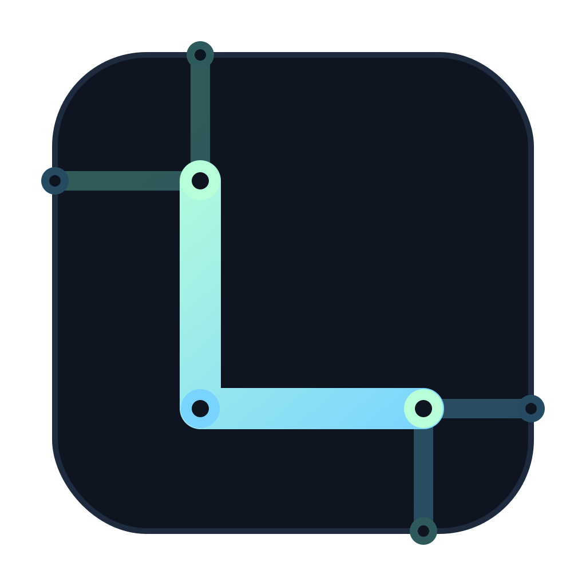
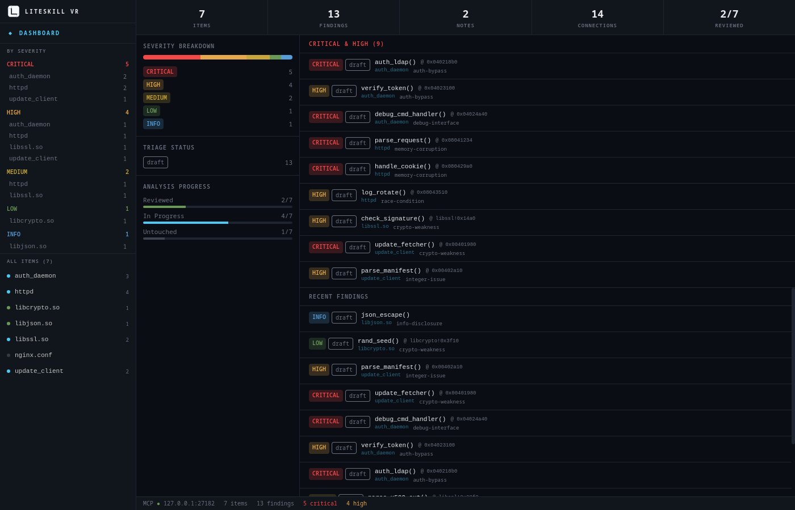

<p align="center">
  
</p>

<h1 align="center">LiteSkill VR</h1>

<p align="center">
  Desktop application for methodical vulnerability research documentation. Built with Tauri v2, React, and TypeScript.
</p>

<p align="center">
  
</p>

See [spec/](spec/) for detailed design documents.

## Development

```bash
pnpm install
pnpm tauri dev
```

## Scripts

| Script               | Purpose                                                      |
| -------------------- | ------------------------------------------------------------ |
| `pnpm dev`           | Start Vite dev server                                        |
| `pnpm tauri dev`     | Start Tauri dev mode                                         |
| `pnpm check`         | Run all checks (typecheck, lint, oxlint, format, knip, test) |
| `pnpm check:rust`    | Run Rust checks (clippy, fmt)                                |
| `pnpm check:all`     | Run both TS and Rust checks                                  |
| `pnpm test`          | Run unit tests                                               |
| `pnpm test:e2e`      | Run E2E tests (requires release build)                       |
| `pnpm test:coverage` | Run tests with coverage                                      |

## Building

```bash
# Release binary
APPIMAGE_EXTRACT_AND_RUN=1 NO_STRIP=1 pnpm tauri build

# Binary only (no .deb/.rpm/.AppImage bundles)
pnpm tauri build --no-bundle
```

## Headless MCP server

A second binary, `liteskillvr-mcp`, runs just the MCP interface against a
`.lsvr` project file without the GUI or any Tauri system dependencies. It
supports both HTTP and stdio transports.

Pre-built binaries for Linux, macOS (x86_64 and aarch64), and Windows ship
with each [release](../../releases) as `liteskillvr-mcp-headless-<target-triple>[.exe]`.
The Linux `.deb` / `.rpm` packages also install it to `/usr/bin/liteskillvr-mcp`
alongside the desktop app.

To build from source:

```bash
# No GUI deps needed
cd src-tauri
cargo build --release --bin liteskillvr-mcp --no-default-features

# HTTP transport (default) — agents connect to http://127.0.0.1:<port>/mcp
./target/release/liteskillvr-mcp path/to/project.lsvr
./target/release/liteskillvr-mcp --port 27182 path/to/project.lsvr

# stdio transport — agents spawn the binary and talk JSON-RPC over stdin/stdout
./target/release/liteskillvr-mcp --stdio path/to/project.lsvr

# Create the project file if it doesn't exist
./target/release/liteskillvr-mcp --init path/to/project.lsvr
```

Useful on headless machines (CI, servers) where WebKitGTK isn't available, and
for MCP clients that prefer to spawn the server as a subprocess.

## Prerequisites

- Node.js >= 22
- Rust >= 1.77
- [Tauri v2 Linux dependencies](https://tauri.app/start/prerequisites/#linux)
- `WebKitWebDriver` (for E2E tests): `dnf install webkit2gtk4.1-webdriver`
